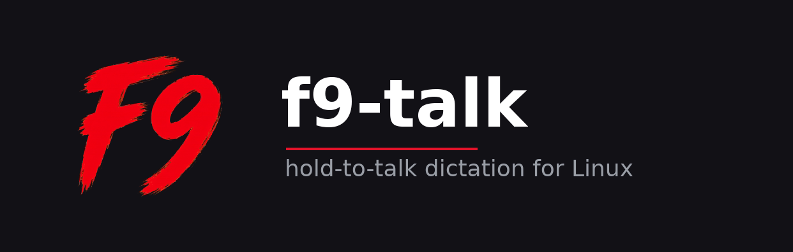

<p align="center">
  
</p>

# f9-talk

[](https://www.rust-lang.org/) [-FCC624?logo=linux&logoColor=black)](https://www.linux.org/) [](LICENSE)

Hold-to-talk dictation for Linux. Press **F9**, speak, release — the
transcript types itself into whatever app you're focused on. Works
system-wide, in any text field. Powered by Deepgram Nova-3 streaming.

A single statically-linked Rust binary. On Wayland the indicator is a
native `wlr-layer-shell` voice wave; X11 is supported too.

## Install

Easiest path — the prebuilt `.deb`. One command pulls in **everything**
(the binary, its shared libraries, and the `wl-clipboard` + `wtype`
typing tools):

```bash
# Download from https://github.com/moamen1358/f9-talk/releases/latest
sudo apt install ./f9-talk_*.deb
```

The `.deb` is fully automated (binary, apps menu, autostart, udev rule,
`input` group, secrets stub). Then **log out and back in once** (for the
`input` group) and set your API key — see below. That's the whole setup. The **AppImage** and **`curl | sh`**
(cargo-dist) paths leave the system untouched, so reach the same end
state with one extra `install` call:

```bash
# AppImage
./f9-talk-*.AppImage install --user        # apps menu, autostart, secrets stub
sudo ./f9-talk-*.AppImage install --system # udev rule + adds you to `input`

# cargo-dist
curl --proto '=https' --tlsv1.2 -LsSf \
  https://github.com/moamen1358/f9-talk/releases/latest/download/f9-talk-installer.sh | sh
f9-talk install --user
# `sudo` strips PATH; pass the absolute path so it finds the binary:
sudo "$(command -v f9-talk)" install --system
```

`f9-talk uninstall [--user|--system]` reverses either step; secrets are
always preserved. After any path, **log out and back in once** so the
`input` group membership takes effect.

Or run straight from this repo:

```bash
git clone https://github.com/moamen1358/f9-talk.git
cd f9-talk
# One-time: Rust toolchain + Linux build deps (see docs/architecture.md
# for the full apt line). Then:
./run.sh --build
```

## Configure the API key

Paste a Deepgram key into `~/.config/F9_talk/secrets.env`
([free tier here](https://console.deepgram.com/signup)):

```ini
DEEPGRAM_API_KEY=your_key_here
```

(Or export `DEEPGRAM_API_KEY` in the environment.) Restart f9-talk after
setting it.

## Use

Hold **F9**, speak, release. The transcript is typed at your cursor. A
red voice-wave appears at the bottom-center of the screen while you hold
F9, reacting to your voice.

## Options

| Command | Result |
|---|---|
| `f9-talk` | Run it — hold F9 to dictate |
| `f9-talk --indicator-margin 80` | Pixels the indicator sits above the bottom edge (default 20) |
| `f9-talk -v` | Verbose logging |
| `f9-talk install [--user\|--system]` | Set up desktop integration (apps menu, autostart, udev rule, `input` group) |
| `f9-talk uninstall [--user\|--system]` | Reverse it. Secrets are preserved. |

To make a flag permanent, edit `Exec=` in
`/etc/xdg/autostart/f9-talk.desktop`.

## Build, architecture, troubleshooting

See [docs/architecture.md](docs/architecture.md) for the workspace
layout, reliability mechanisms, build-from-source instructions, and the
troubleshooting table.

## License

MIT.
