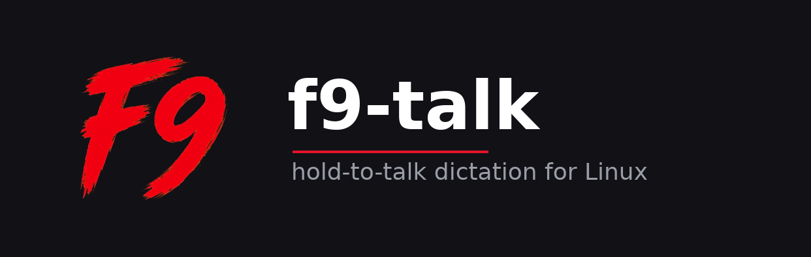

<p align="center">
  
</p>

# f9-talk

[](https://www.rust-lang.org/) [-FCC624?logo=linux&logoColor=black)](https://www.linux.org/) [](LICENSE)

Hold-to-talk dictation for Linux. Press **F9**, speak, release — the
transcript types itself into whatever app you're focused on. Works
system-wide, in any text field. Powered by AssemblyAI Universal-3.6 Pro
Realtime streaming, with Deepgram Nova-3 one config line away.

A single statically-linked Rust binary. On Wayland the indicator is a
native `wlr-layer-shell` voice wave; X11 is supported too.

## Install

The release ships a single self-contained **[AppImage](https://github.com/moamen1358/f9-talk/releases/latest)** —
the binary, its libraries, and the `wl-clipboard` / `wtype` typing tools,
all in one file. Five steps:

```bash
# 1. Download the latest self-contained AppImage into ~/Applications:
mkdir -p ~/Applications && cd ~/Applications
curl -fL -o f9-talk.AppImage "$(curl -fsSL \
  https://api.github.com/repos/moamen1358/f9-talk/releases/latest \
  | grep browser_download_url | grep '\.AppImage' | cut -d'"' -f4)"
chmod +x f9-talk.AppImage

# 2. One-time setup — desktop integration, then uinput access (needs sudo):
./f9-talk.AppImage install --user         # apps menu, autostart, icon, secrets file
sudo ./f9-talk.AppImage install --system  # udev rule + adds you to the `input` group

# 3. Log out and back in once   ← so the `input`-group membership applies

# 4. Put your AssemblyAI API key in the .env file (free credit on sign-up:
#    https://www.assemblyai.com/dashboard). This overwrites the placeholders
#    that step 2 created at ~/.config/F9_talk/secrets.env:
echo 'ASSEMBLYAI_API_KEY=your_key_here' > ~/.config/F9_talk/secrets.env

# 5. Run it — or just log back in, it autostarts:
./f9-talk.AppImage
```

Then **hold F9, speak, release** — the transcript types at your cursor.

The only host requirement is **`libfuse2`** (every AppImage needs it) —
`sudo apt install libfuse2` if it's missing. `f9-talk uninstall
[--user|--system]` reverses step 2; your API key is always kept.

### Build from source

```bash
git clone https://github.com/moamen1358/f9-talk.git
cd f9-talk
# One-time: Rust toolchain + Linux build deps (see docs/architecture.md).
./run.sh --build
```

## Use

Hold **F9**, speak, release — the transcript is typed at your cursor.

A small **red dot** sits at the bottom-center of the screen whenever
f9-talk is running, so you can see it's alive and listening. While you
hold F9 it morphs into a red **voice wave** that reacts to your voice,
then settles back to the dot on release.

**To quit:** hover the dot — it turns into a red **×** — and click it.
The tool exits cleanly; relaunch it from the apps menu (or just log in
again, it autostarts).

## Settings

Two plain-text files in `~/.config/F9_talk/`, written with commented
defaults on first run. Quit f9-talk (click the dot) and start it again
after editing either one.

**`keyterms.txt`**: names and jargon to always get right, one per line
(GitHub, Kubernetes, .env, em dash, your colleagues' names, ...). The default file boosts nothing. Up to 100 terms; both services use them.

**`config.toml`**:

| Setting | Default | Meaning |
|---|---|---|
| `backend` | `"assemblyai"` | `"assemblyai"` (Universal-3.6 Pro) or `"deepgram"` (Nova-3). Each needs its key in `secrets.env`: `ASSEMBLYAI_API_KEY` or `DEEPGRAM_API_KEY`. |
| `assemblyai_warm_seconds` | `60` | AssemblyAI bills every second its connection is open, idle or not, so f9-talk closes it this long after your last dictation and reopens it on the next press. Your audio is kept while it reconnects, so no word is lost. `0` keeps it open all the time (about $0.45 per hour f9-talk runs). |
| `finalize_timeout_ms` | `4000` | Safety net for the final text after release. It normally arrives in 0.1 to 0.4 s. |

To go back to Deepgram, set one line in `config.toml`:

```toml
backend = "deepgram"
```

On release f9-talk asks the service to finalize and waits for the
finished text of everything you said, so a sentence is never cut at the
end. If the key for the chosen service is missing but the other one is
set, f9-talk uses the other service and says so in its log.

## Options

| Command | Result |
|---|---|
| `f9-talk` | Run it — hold F9 to dictate |
| `f9-talk --indicator-margin 80` | Pixels the indicator sits above the bottom edge (default 20) |
| `f9-talk -v` | Verbose logging |
| `f9-talk install [--user\|--system]` | Set up desktop integration (apps menu, autostart, udev rule, `input` group) |
| `f9-talk uninstall [--user\|--system]` | Reverse it. Secrets are preserved. |

To make a flag permanent, edit `Exec=` in your autostart entry
(`~/.config/autostart/f9-talk.desktop`).

## Build, architecture, troubleshooting

See [docs/architecture.md](docs/architecture.md) for the workspace
layout, reliability mechanisms, build-from-source instructions, and the
troubleshooting table.

## License

MIT.
