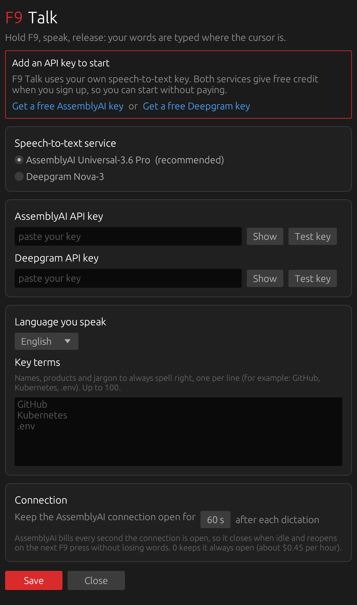

<p align="center">
  
</p>

# F9 Talk

[](https://www.rust-lang.org/) [-FCC624?logo=linux&logoColor=black)](https://www.linux.org/) [](LICENSE)

Hold-to-talk dictation for Linux.
Hold **F9**, speak, release: your words are typed into whatever app has the cursor.
Any text field, any app, on Wayland or X11.

- **Accurate and fast.** Streams to AssemblyAI Universal-3.6 Pro Realtime (the default) or Deepgram Nova-3. The text lands about 0.2 to 0.4 s after you release F9, and a sentence is never cut off at the end.
- **Your words, spelled right.** A key-terms list for names, products and jargon (GitHub, Kubernetes, `.env`, your colleagues' names).
- **One clean sentence per press.** Pause to think mid-sentence and it still comes back as one naturally punctuated sentence.
- **Bring your own key.** No account, no F9 Talk server: your audio goes from your computer straight to the service you pick.
- **Small.** One Rust binary, shipped as a single AppImage. A red dot at the bottom of the screen shows it is running.

## Bring your own key

F9 Talk uses your own speech-to-text API key.
Both services give free credit to start, so you can try it without paying:

| Service | Free to start | Get a key |
|---|---|---|
| AssemblyAI Universal-3.6 Pro (default) | Free credit on sign-up | [assemblyai.com](https://www.assemblyai.com/dashboard/signup) |
| Deepgram Nova-3 | $200 of free credit | [deepgram.com](https://console.deepgram.com/signup) |

On first run the Settings window opens by itself: paste your key, press **Test key**, then **Save**.

<p align="center">
  
</p>

AssemblyAI bills streaming by how long the connection is open (about $0.45 an hour), so F9 Talk closes it 60 s after your last dictation and reopens it on the next press, without losing a word.
Check each service's pricing page for current rates.

## Install

The release is one self-contained **[AppImage](https://github.com/moamen1358/f9-talk/releases/latest)**: the program, its libraries and the `wl-clipboard` / `wtype` typing tools in one file.

```bash
# 1. Download the latest AppImage into ~/Applications:
mkdir -p ~/Applications && cd ~/Applications
curl -fL -o f9-talk.AppImage "$(curl -fsSL \
  https://api.github.com/repos/moamen1358/f9-talk/releases/latest \
  | grep browser_download_url | grep '\.AppImage' | cut -d'"' -f4)"
chmod +x f9-talk.AppImage

# 2. One-time setup: desktop integration, then keyboard access (needs sudo):
./f9-talk.AppImage install --user         # apps menu, autostart, icon
sudo ./f9-talk.AppImage install --system  # udev rule + adds you to the `input` group

# 3. Log out and back in once, so the `input` group membership applies.

# 4. Start it from the apps menu (or ./f9-talk.AppImage). It autostarts
#    at every login from now on. The first time, Settings opens: add a key.
```

Then **hold F9, speak, release**.

The only host requirement is **`libfuse2`** (every AppImage needs it): `sudo apt install libfuse2` if it is missing.
`f9-talk uninstall [--user|--system]` reverses step 2; your keys and settings are kept.

### Build from source

```bash
git clone https://github.com/moamen1358/f9-talk.git
cd f9-talk
# One-time: Rust toolchain + Linux build deps (see docs/architecture.md).
./run.sh --build
```

## Use

Hold **F9**, speak, release: the text is typed at your cursor.

A small **red dot** sits at the bottom-center of the screen while F9 Talk runs.
While you hold F9 it turns into a red **voice wave** that follows your voice, then settles back into the dot.

- **Settings:** right-click the dot, or choose *F9 Talk > Settings* in the apps menu (launching F9 Talk again while it runs also opens Settings).
- **Quit:** hover the dot (it turns into a red **x**) and left-click it. Start it again from the apps menu, or log in again.

## Settings

The Settings window covers everything:

| Setting | What it does |
|---|---|
| Service | AssemblyAI Universal-3.6 Pro (default) or Deepgram Nova-3. |
| API keys | One per service, masked, with **Show** and **Test key** (one free request that answers "works" or the service's exact error). |
| Language | English (default), Spanish, French, German, Italian or Portuguese. |
| Key terms | Names and jargon to always spell right, one per line, up to 100. |
| Connection | How long the AssemblyAI connection stays open after a dictation (60 s; 0 keeps it always open). |

**Save** applies the changes at once; there is nothing to restart.

**Where things are kept:**

- Keys saved in Settings go into your desktop keyring (GNOME Keyring, KWallet, or any Secret Service), not a plain file.
  Without a keyring they go into `~/.config/F9_talk/secrets.env`, readable only by you.
- `ASSEMBLYAI_API_KEY` and `DEEPGRAM_API_KEY` in the environment still work, and win over saved keys.
- The other settings are plain text in `~/.config/F9_talk/`: `config.toml` (service, language, timings) and `keyterms.txt` (one term per line).
  You can edit them by hand too; restart F9 Talk afterwards.
  For example, switching to Deepgram is one line in `config.toml`: `backend = "deepgram"`.

## Command line

| Command | Result |
|---|---|
| `f9-talk` | Run it: hold F9 to dictate |
| `f9-talk settings` | Open the Settings window |
| `f9-talk --indicator-margin 80` | Pixels the dot sits above the bottom edge (default 20) |
| `f9-talk -v` | Verbose logging |
| `f9-talk install [--user\|--system]` | Desktop integration (apps menu, autostart, udev rule, `input` group) |
| `f9-talk uninstall [--user\|--system]` | Reverse it. Keys and settings are kept. |

To make a flag permanent, edit `Exec=` in `~/.config/autostart/f9-talk.desktop`.

## Privacy

Audio leaves your computer only while F9 is held: it is streamed over TLS to the service you chose and never written to disk.
Keys are never logged.
See [SECURITY.md](SECURITY.md).

## Build, architecture, troubleshooting

See [docs/architecture.md](docs/architecture.md) for the workspace layout, how release and reconnects work, build-from-source instructions and the troubleshooting table.

## License

MIT.
